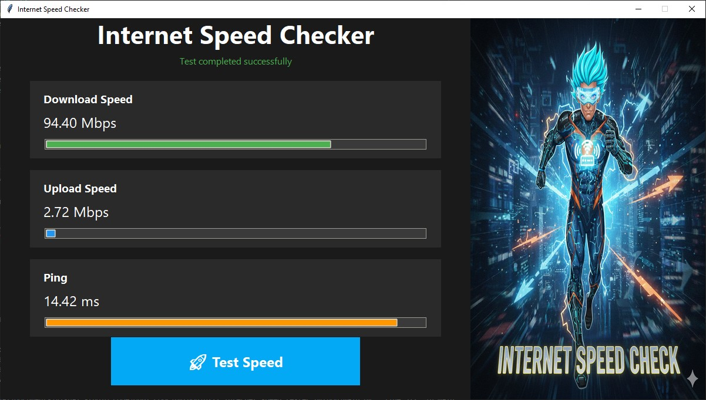

# 🚀 Internet Speed Checker

A fast, modern, and cross-platform desktop application built with Python and Tkinter for accurately measuring your internet connection's download speed, upload speed, and ping (latency). The application features a dynamic, dark theme with a cyber-energetic aesthetic and a dedicated panel for visual flair.

## ✨ Features

Real-time Speed Measurement: Accurate results for download and upload speeds (Mbps) and ping (ms) using the speedtest-cli library.

Modern Tkinter UI: Custom dark theme design using the ttk.Style for progress bars and visual appeal.

Asynchronous Testing: Speed tests run in a separate thread to prevent the application UI from freezing.

Dynamic Progress Bars: Visually engaging progress animations for test stages.

Custom Layout: Wide window design with the main application interface on the left and a dedicated visual/background panel on the right.

# 🖼️ Application Screenshot

The application is styled with a dark, energetic theme, featuring a wide layout where the metrics are displayed on the left and a cyber-themed background image is featured on the right.

🔧 Prerequisites

This application requires Python 3.x and the following libraries:

Pillow (PIL): For handling image loading and resizing (e.g., the background image).

Speedtest-cli: The backend for performing the actual speed tests.

⚙️ Installation and Setup

1. Python Environment

Ensure you have Python 3 installed on your system.

2. Install Dependencies

Open your terminal or command prompt in the project directory and run the following command to install the necessary libraries:

pip install Pillow speedtest-cli

3. Image Setup (Mandatory)

The application expects the background image to be located in a specific path.

Make sure your image (e.g., the one with the cyber-superhero figure) is saved as test2.png and placed inside the expected directory structure:

/p117_internet_speed_tester_python
|-- main.py
|-- src/
|   |-- images/
|       |-- test2.png  <-- The image file goes here

▶️ Usage

To run the application, execute the main.py file from your terminal:

python main.py

The application window (1200x650 pixels) will appear.

Click the "🚀 Test Speed" button to begin the test.

The status label and a spinning loader will indicate that the test is in progress (Finding Server, Testing Download, Testing Upload).

Once completed, the final metrics will be displayed in Mbps and ms.

👨‍💻 Structure Highlights

The application uses the Tkinter place() geometry manager to achieve the split-panel layout, ensuring all UI elements remain centered in the left 800-pixel section while the image fills the right 400-pixel section. All speed test logic runs in a separate threading.Thread to maintain UI responsiveness.